<div align="center">

  <br />

  <h1 style="font-size: 3rem; margin-bottom: 0;">SISO Token Standard</h1>

  <p style="font-size: 1.1rem; color: #b298dc; max-width: 600px;">
    <strong>A production-grade, DevOps-ready ERC-20 Primitive.</strong><br/>
    Featuring Role-Based Access Control, deflationary mechanics, and emergency circuit breakers.
  </p>

  <p>
    <a href="https://sepolia.etherscan.io/address/0xc8C711CDf3fD162b00F3447C6963C52aF3d44AAb">
      
    </a>
    &nbsp;
    <a href="https://github.com/NexTechArchitect/SISO-Token-ERC20">
      
    </a>
    &nbsp;
    <a href="https://github.com/NexTechArchitect/SISO-Token-ERC20">
      
    </a>
  </p>

  <br />

</div>

---

## 📑 Table of Contents

- [📊 Contract Specifications](#-contract-specifications)
- [🏗 Project Architecture](#-project-architecture)
- [🛡 Security & Features](#-security--features)
- [⚙️ Access Control Matrix](#%EF%B8%8F-access-control-matrix)

---

## 📊 Contract Specifications

<div align="center">

| **Parameter** | **Configuration Value** |
| :--- | :--- |
| **Token Name** | `SISO Token` |
| **Ticker Symbol** | `$SISO` |
| **Total Supply** | `1,000,000,000` (1 Billion) |
| **Precision** | `18 Decimals` (Standard) |
| **Explorer** | [🔎 View on Sepolia Etherscan](https://sepolia.etherscan.io/address/0xc8C711CDf3fD162b00F3447C6963C52aF3d44AAb) |

</div>

---

## 🏗 Project Architecture

Designed with a modular folder structure for maximum clarity and testing efficiency using the **Foundry** framework.

* 📂 **`src/`**
    * 📄 `SisoToken.sol` — The core logic (Inherits ERC20, Ownable, Pausable).
* 📂 **`script/`**
    * 🚀 `DeploySisoToken.s.sol` — Automated blockchain deployment via DevOps pipelines.
    * 🪙 `MintSisoToken.s.sol` — Admin-controlled minting scripts.
    * 🔥 `BurnSisoToken.s.sol` — Supply reduction & deflationary logic.
    * ⏸️ `PauseSisoToken.s.sol` — Emergency circuit breaker controls.
* 📂 **`test/`**
    * 🧪 `SisoToken.t.sol` — Invariant, Fuzz, and Unit test suite.

---

## 🛡 Security & Features

<table width="100%">
  <tr>
    <td width="50%" valign="top">
      <h3>🔐 Attack Surface Reduction</h3>
      <ul>
        <li><b>RBAC (Role-Based Access Control):</b> Strictly enforces Owner-only minting and admin functions.</li>
        <li><b>Circuit Breaker:</b> Emergency <code>pause()</code> functionality to freeze all token transfers during security incidents.</li>
        <li><b>Audit Ready:</b> Utilizes battle-tested OpenZeppelin libraries to minimize logic errors.</li>
      </ul>
    </td>
    <td width="50%" valign="top">
      <h3>⚙️ Tokenomics Engine</h3>
      <ul>
        <li><b>Deflationary Capable:</b> Native <code>burn</code> mechanism allows the owner to permanently reduce total supply.</li>
        <li><b>DeFi Compatible:</b> Full support for <code>approve</code>, <code>transferFrom</code>, and <code>increaseAllowance</code> workflows.</li>
        <li><b>CI/CD Ready:</b> Scriptable deployment flow for automated testing pipelines.</li>
      </ul>
    </td>
  </tr>
</table>

---

## ⚙️ Access Control Matrix

This contract implements a strict **Permission Matrix** to ensure security while allowing open participation in tokenomics.

### 🛡️ Administrative Roles

| Function | User (Public) | Owner (Admin) | Description |
| :--- | :---: | :---: | :--- |
| **`transfer`** | ✅ | ✅ | Standard ERC-20 transfers. |
| **`approve`** | ✅ | ✅ | Grant spending allowance to DeFi protocols. |
| **`burn`** | ❌ | ✅ | **Restricted:** Only Admin can destroy tokens. |
| **`mint`** | ❌ | ✅ | **Restricted:** Only Admin can print new supply. |
| **`pause`** | ❌ | ✅ | **Emergency:** Freezes the entire contract. |

### 🩸 Circuit Breaker Logic

We implement the `Pausable` module to protect the ecosystem during unforeseen events.

```mermaid
graph LR
    Call[User calls Transfer]
    Check{Is Contract Paused?}
    Status_Active[Active State]
    Status_Paused[Paused State]
    
    Call --> Check
    Check -- No --> Status_Active
    Status_Active --> Execute[✅ Execute Transfer]
    
    Check -- Yes --> Status_Paused
    Status_Paused --> Revert[❌ Revert Transaction]
    
    style Status_Active fill:#1a1a1a,stroke:#b298dc
    style Status_Paused fill:#2d1b4e,stroke:#9d4edd,stroke-width:2px

```



> **Note:** When paused, only `view` functions remain accessible. State-changing actions (Transfer, Mint, Burn) are strictly blocked.

---

<div align="center">


<b>Engineered by NEXTECHARHITECT</b>


<i>Smart Contract Developer · Solidity · Foundry · Web3 Engineering</i>


<a href="https://github.com/NexTechArchitect">GitHub</a> •
<a href="https://www.google.com/search?q=https://twitter.com/NexTechArchitect">Twitter</a>
</div>

```

```
