<div align="center">
  

  <br/>

  <p>
    <a href="https://sepolia.etherscan.io/address/0xc8C711CDf3fD162b00F3447C6963C52aF3d44AAb">
      
    </a>
    
    
    
  </p>

  <p width="90%">
    <b>A production-grade, access-controlled, and burn-ready ERC-20 implementation.</b><br/>
    Designed as a robust primitive for testing DeFi integrations, staking mechanics, and automated deployments.
  </p>
  
  <br/>

  <table>
    <tr>
      <td align="center"><a href="#-contract-details"><strong>📄 Details</strong></a></td>
      <td align="center"><a href="#-project-architecture"><strong>🏗 Architecture</strong></a></td>
      <td align="center"><a href="#-key-features"><strong>💎 Features</strong></a></td>
      <td align="center"><a href="#-mechanics--access-control"><strong>⚙️ Mechanics</strong></a></td>
    </tr>
  </table>

</div>

---

## 📊 Contract Details

<div align="center">

| **Parameter** | **Value** |
| :--- | :--- |
| **Token Name** | `SISO Token` |
| **Symbol** | `$SISO` |
| **Total Supply** | `1,000,000,000` |
| **Decimals** | `18` |
| **Verified Contract** | [`0xc8C711...4AAb`](https://sepolia.etherscan.io/address/0xc8C711CDf3fD162b00F3447C6963C52aF3d44AAb) |

</div>

---

## 🏗 Project Architecture

Designed with a modular folder structure for maximum clarity and testing efficiency.

* 📂 **`src/`**
    * 📄 `SisoToken.sol` — The core logic (Inherits ERC20, Ownable, Pausable).
* 📂 **`script/`**
    * 🚀 `DeploySisoToken.s.sol` — Automated blockchain deployment.
    * 🪙 `MintSisoToken.s.sol` — Admin-controlled minting scripts.
    * 🔥 `BurnSisoToken.s.sol` — Supply reduction logic.
    * ⏸️ `PauseSisoToken.s.sol` — Emergency circuit breaker controls.
* 📂 **`test/`**
    * 🧪 `SisoToken.t.sol` — Invariant, Fuzz, and Unit test suite.

---

## 💎 Key Features

<table width="100%">
  <tr>
    <td width="50%" valign="top">
      <h3>🔐 Security First</h3>
      <ul>
        <li><b>Strict Access Control:</b> Owner-only minting and admin functions.</li>
        <li><b>Circuit Breaker:</b> Emergency <code>pause()</code> functionality to freeze transfers during incidents.</li>
        <li><b>Pattern:</b> Isolated ownership logic via OpenZeppelin.</li>
      </ul>
    </td>
    <td width="50%" valign="top">
      <h3>⚙️ Tokenomics Engine</h3>
      <ul>
        <li><b>Deflationary:</b> Native <code>burn</code> mechanism to reduce total supply.</li>
        <li><b>Standardized:</b> Full support for <code>approve</code> & <code>transferFrom</code> workflows.</li>
        <li><b>Automated:</b> Scriptable deployment flow for CI/CD pipelines.</li>
      </ul>
    </td>
  </tr>
</table>

---

## ⚙️ Mechanics & Access Control

This contract implements a strict **Permission Matrix** to ensure security while allowing open participation in tokenomics.

### 🛡️ Administrative Roles

| Function | User | Owner / Admin | Description |
| :--- | :---: | :---: | :--- |
| **`transfer`** | ✅ | ✅ | Standard ERC-20 transfers. |
| **`approve`** | ✅ | ✅ | Grant spending allowance to other addresses. |
| **`burn`** | ❌ | ✅ | **Restricted:** Only Owner can destroy tokens. |
| **`mint`** | ❌ | ✅ | **Restricted:** Create new tokens (Owner Only). |
| **`pause / unpause`** | ❌ | ✅ | **Emergency:** Freeze all transfers (Owner Only). |

### 🩸 Circuit Breaker Logic (Pausable)

We implement the `Pausable` module to protect the ecosystem during unforeseen events.

```mermaid
graph LR
    Call[User calls Transfer]
    Check{Is Contract Paused?}
    Status_Active[Active State]
    Status_Paused[Paused State]
    
    Call --> Check
    Check -- No --> Status_Active
    Status_Active --> Execute[✅ Execute Transfer]
    
    Check -- Yes --> Status_Paused
    Status_Paused --> Revert[❌ Revert Transaction]

```



> **Note:** When paused, only `view` functions remain accessible. State-changing actions (Transfer, Mint, Burn) are blocked to prevent exploitation.

---

<div align="center">


<b>Protocol Engineered by NexTechArchitect</b>


<i>Building the Future of Web3</i>


<a href="https://github.com/NexTechArchitect">

</a>
&nbsp;&nbsp;
<a href="https://linkedin.com/in/amit-kumar-811a11277">

</a>
&nbsp;&nbsp;
<a href="https://x.com/itZ_AmiT0">

</a>

</div>

```

```
